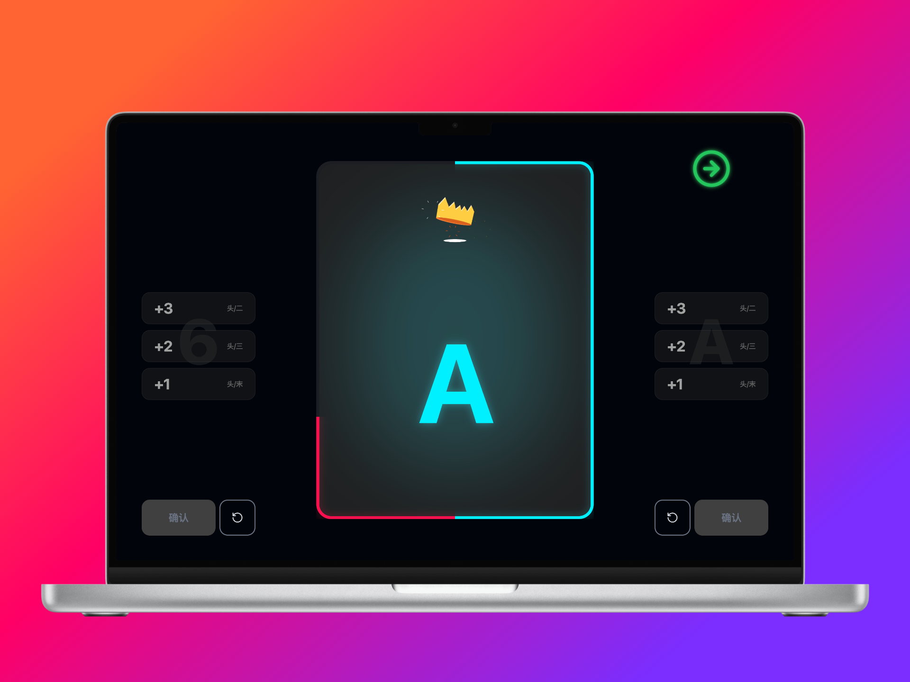

# 惯蛋计分器

## 使用地址

https://guandan.mapin.net/

---

## 界面预览

| 电脑端 | 平板端 | 手机端 |
| :----: | :----: | :----: |
|  |  |  |

---

## 项目介绍

周末经常会和朋友打惯蛋，但是老是打着打着就忘了这轮打几、谁贡牌了，所以写了一个网页端的惯蛋计分器，平时打牌的时候可以开着 iPad 放在旁边当实时的记牌器。

---

## 规则说明

- **级数**：从 2 打到 A，再到 A2、A3。打 A 阶段头游+二游或头游+三游即获胜。
- **加分**：头游+二游 +3、头游+三游 +2、头游+末游 +1。只给赢家一方加分。
- **进贡**：双下（头游+二游）时双贡，单下（头游+三游）或保级（头游+末游）时单贡。末游进贡给头游，双贡时三游进贡给二游。
- **打级方**：赢家成为下一轮的庄家（打级方），中央大号数字显示当前是谁在打几。

---

## 使用方法

### 左侧：红方

- 选择本局结果：+3（头/二）、+2（头/三）、+1（头/末）
- 确认、撤销

### 右侧：蓝方

- 选择本局结果：+3（头/二）、+2（头/三）、+1（头/末）
- 确认、撤销

### 中间

- 当前打级方的大号级数（带颜色）
- 红蓝双方进度条
- 打 A 获胜时会显示皇冠动画

### 进贡区域

每局结束后自动展示本局的进贡关系：末游→头游（进大/进小）、三游→二游（双贡时）。

---

## 适配

iPad、电脑端。手机建议横屏使用；竖屏窄屏会提示旋转。
